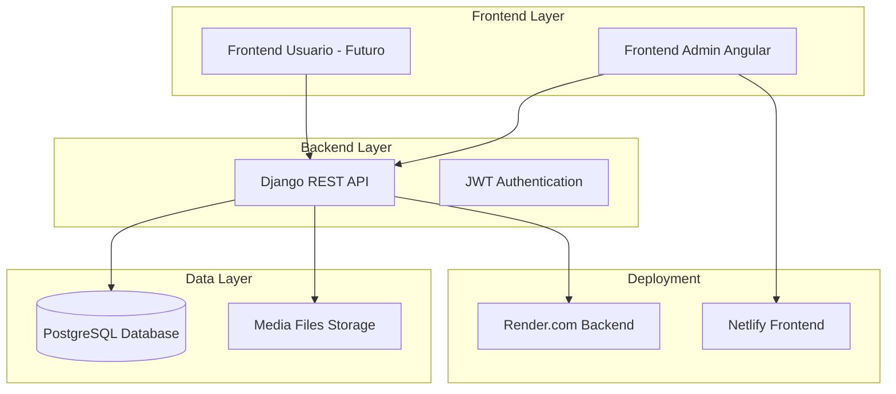

# Documento de Diseño Técnico - Completar Aplicación de Venta de Vehículos

## Introducción

Este documento describe el diseño técnico para completar la aplicación de venta de vehículos, incluyendo la finalización de las configuraciones del frontend de administración Angular, la migración a GitHub, el redespliegue completo de la aplicación, y la corrección de errores de conexión en los endpoints de elementos destacados.

## Arquitectura General

### Arquitectura Actual


### Arquitectura Objetivo
```mermaid
graph TB
    subgraph "Source Control"
        GH[GitHub Repository]
    end
    
    subgraph "Frontend Layer"
        FA[Frontend Admin Angular - Completado]
        FU[Frontend Usuario - Opcional]
    end
    
    subgraph "Backend Layer"
        API[Django REST API - Mejorado]
        AUTH[JWT Authentication]
        SETTINGS[Settings Management API]
    end
    
    subgraph "Data Layer"
        DB[(PostgreSQL Database)]
        MEDIA[Media Files Storage]
    end
    
    subgraph "New Deployment Platform"
        DEPLOY[Nueva Plataforma de Despliegue]
        CDN[CDN para Media Files]
    end
    
    GH --> FA
    GH --> API
    FA --> API
    FU --> API
    API --> DB
    API --dne: string;
}

interface AppearanceSettings {
  theme: 'light' | 'dark';
  primaryColor: string;
  secondaryColor: string;
  font: string;
  logo?: File;
}

interface NotificationSettings {
  emailNotifications: boolean;
  salesNotifications: boolean;
  inventoryNotifications: boolean;
  marketingNotifications: boolean;
  securityNotifications: boolean;
}

interface SecuritySettings {
  twoFactorAuth: boolean;
  sessionTimeout: number;
  passwordExpiry: number;
  loginAttempts: number;
}
```

#### API de Configuraciones Backend
```python
# Nuevo modelo para configuraciones
class SystemConfiguration(models.Model):
    key = models.CharField(max_length=100, unique=True)
    value = models.JSONField()
    category = models.CharField(max_length=50)
    created_at = models.DateTimeField(auto_now_add=True)
    updated_at = models.DateTimeField(auto_now=True)
    updated_by = models.ForeignKey(User, on_delete=models.CASCADE)

# Nuevos endpoints
class ConfigurationViewSet(viewsets.ModelViewSet):
    queryset = SystemConfiguration.objects.all()
    serializer_class = ConfigurationSerializer
    permission_classes = [IsAuthenticated]
```

### 2. Integración con GitHub

#### Estructura del Repositorio
```
vehicle-sales-app/
├── backend/
│   ├── backend/
│   ├── vehicles/
│   ├── requirements.txt
│   ├── Procfile
│   └── README.md
├── frontend-admin/
│   ├── src/
│   ├── package.json
│   ├── angular.json
│   └── README.md
├── frontend-user/ (opcional)
├── docs/
│   ├── API.md
│   ├── DEPLOYMENT.md
│   └── DEVELOPMENT.md
├── .github/
│   └── workflows/
│       ├── backend-deploy.yml
│       └── frontend-deploy.yml
├── docker-compose.yml
└── README.md
```

#### GitHub Actions para CI/CD
```yaml
# .github/workflows/backend-deploy.yml
name: Deploy Backend
on:
  push:
    branches: [main]
    paths: ['backend/**']

jobs:
  deploy:
    runs-on: ubuntu-latest
    steps:
      - uses: actions/checkout@v3
      - name: Deploy to Platform
        run: |
          # Comandos de despliegue automático
```

### 3. Nueva Plataforma de Despliegue

#### Opciones de Plataforma Evaluadas
1. **Vercel** - Para frontend y backend serverless
2. **Netlify + Heroku** - Frontend en Netlify, backend en Heroku
3. **DigitalOcean App Platform** - Solución completa
4. **AWS Amplify + Elastic Beanstalk** - Solución AWS

#### Configuración de Despliegue Recomendada
- **Frontend**: Vercel o Netlify
- **Backend**: Heroku o DigitalOcean
- **Base de Datos**: PostgreSQL gestionada
- **Media Files**: AWS S3 o Cloudinary

### 4. Corrección de Errores de Conexión

#### Análisis de Errores ERR_CONNECTION_RESET
Los errores ocurren en:
- `/api/featured/`
- `/api/available-cars/`
- `/api/available-motorcycles/`

#### Mejoras Propuestas

##### Connection Pooling y Retry Logic
```python
# settings.py - Configuración de base de datos mejorada
DATABASES = {
    'default': {
        'ENGINE': 'django.db.backends.postgresql',
        'OPTIONS': {
            'MAX_CONNS': 20,
            'OPTIONS': {
                'MAX_CONNS': 20,
                'connect_timeout': 10,
                'application_name': 'vehicle_app',
            }
        },
        'CONN_MAX_AGE': 600,
        'CONN_HEALTH_CHECKS': True,
    }
}
```

##### Middleware de Retry
```python
class RetryMiddleware:
    def __init__(self, get_response):
        self.get_response = get_response

    def __call__(self, request):
        max_retries = 3
        for attempt in range(max_retries):
            try:
                response = self.get_response(request)
                return response
            except Exception as e:
                if attempt == max_retries - 1:
                    raise e
                time.sleep(0.5 * (attempt + 1))
```

##### Optimización de Queries
```python
# Optimización de vistas problemáticas
class AvailableCarsListView(generics.ListAPIView):
    def get_queryset(self):
        return Car.objects.select_related('created_by').prefetch_related(
            'featureditem_set'
        ).exclude(
            featureditem__isnull=False
        ).order_by('-created_at')
```

## Modelos de Datos

### Nuevo Modelo de Configuraciones
```python
class SystemConfiguration(models.Model):
    CATEGORY_CHOICES = [
        ('general', 'General'),
        ('appearance', 'Apariencia'),
        ('notifications', 'Notificaciones'),
        ('security', 'Seguridad'),
    ]
    
    key = models.CharField(max_length=100, unique=True)
    value = models.JSONField()
    category = models.CharField(max_length=20, choices=CATEGORY_CHOICES)
    description = models.TextField(blank=True)
    is_active = models.BooleanField(default=True)
    created_at = models.DateTimeField(auto_now_add=True)
    updated_at = models.DateTimeField(auto_now=True)
    updated_by = models.ForeignKey(User, on_delete=models.CASCADE)
    
    class Meta:
        ordering = ['category', 'key']
        
    def __str__(self):
        return f"{self.category}.{self.key}"
```

### Modelo de Logs de Sistema
```python
class SystemLog(models.Model):
    LOG_LEVELS = [
        ('DEBUG', 'Debug'),
        ('INFO', 'Info'),
        ('WARNING', 'Warning'),
        ('ERROR', 'Error'),
        ('CRITICAL', 'Critical'),
    ]
    
    level = models.CharField(max_length=10, choices=LOG_LEVELS)
    message = models.TextField()
    module = models.CharField(max_length=100)
    user = models.ForeignKey(User, on_delete=models.SET_NULL, null=True, blank=True)
    ip_address = models.GenericIPAddressField(null=True, blank=True)
    timestamp = models.DateTimeField(auto_now_add=True)
    extra_data = models.JSONField(default=dict, blank=True)
    
    class Meta:
        ordering = ['-timestamp']
        indexes = [
            models.Index(fields=['level', 'timestamp']),
            models.Index(fields=['module', 'timestamp']),
        ]
```

## Correctness Properties

*Una propiedad es una característica o comportamiento que debe mantenerse verdadero en todas las ejecuciones válidas de un sistema, esencialmente, una declaración formal sobre lo que el sistema debe hacer. Las propiedades sirven como puente entre las especificaciones legibles por humanos y las garantías de corrección verificables por máquinas.*

### Prework Analysis Continuation

3.2 THE Sistema_Administracion SHALL ser desplegado y accesible públicamente
  Thoughts: This is about deployment accessibility. We can test this by making HTTP requests to the deployed frontend and verifying it responds correctly.
  Testable: yes - example

3.4 WHEN los frontends se conecten al backend, THE Sistema_Administracion SHALL usar las URLs correctas del Backend_API desplegado
  Thoughts: This is about configuration correctness. We can test that frontend API calls are made to the correct backend URLs.
  Testable: yes - property

3.5 THE Plataforma_Despliegue SHALL mantener la base de datos PostgreSQL con todos los datos existentes
  Thoughts: This is about data migration and persistence. We can test this by verifying that all expected data exists in the deployed database.
  Testable: yes - property

3.6 WHEN se acceda a la aplicación desplegada, THE Sistema_Administracion SHALL cargar correctamente sin errores de conexión
  Thoughts: This is about deployment health. We can test this by accessing the deployed application and verifying it loads without connection errors.
  Testable: yes - property

3.7 THE Backend_API SHALL servir archivos de media (imágenes de vehículos) correctamente desde el despliegue
  Thoughts: This is about media file serving. We can test this by requesting media files and verifying they are served correctly with proper headers and content.
  Testable: yes - property

4.1 WHEN se intente cargar elementos destacados, THE Backend_API SHALL responder sin errores ERR_CONNECTION_RESET
  Thoughts: This is about connection stability for a specific endpoint. We can test this by making requests to the featured items endpoint and verifying no connection reset errors occur.
  Testable: yes - property

4.2 WHEN se soliciten autos disponibles para destacar, THE Backend_API SHALL devolver la lista completa sin errores de conexión
  Thoughts: This is about connection stability for available cars endpoint. We can test this by requesting available cars and verifying the response is complete without connection errors.
  Testable: yes - property

4.3 WHEN se soliciten motos disponibles para destacar, THE Backend_API SHALL devolver la lista completa sin errores de conexión
  Thoughts: This is about connection stability for available motorcycles endpoint. We can test this by requesting available motorcycles and verifying the response is complete without connection errors.
  Testable: yes - property

4.4 THE Backend_API SHALL mantener conexiones estables en la URL https://webvehicles-backend.onrender.com/api/
  Thoughts: This is about overall connection stability. We can test this by making multiple requests over time and verifying connections remain stable.
  Testable: yes - property

4.5 IF ocurren errores de conexión, THEN THE Backend_API SHALL implementar reintentos automáticos
  Thoughts: This is about retry logic implementation. We can test this by simulating connection failures and verifying that automatic retries are attempted.
  Testable: yes - property

4.6 THE Sistema_Administracion SHALL mostrar mensajes de error informativos cuando no pueda conectarse al Backend_API
  Thoughts: This is about error handling and user feedback. We can test this by simulating connection failures and verifying appropriate error messages are displayed.
  Testable: yes - property

4.7 WHEN se destaque un vehículo exitosamente, THE Sistema_Administracion SHALL actualizar la lista de elementos destacados inmediatamente
  Thoughts: This is about UI state management after successful operations. We can test this by featuring a vehicle and verifying the featured list updates immediately.
  Testable: yes - property

5.1 THE Sistema_Administracion SHALL permitir crear, editar y eliminar vehículos sin errores
  Thoughts: This is about CRUD operations working correctly. We can test this by performing create, read, update, delete operations on vehicles and verifying they complete successfully.
  Testable: yes - property

5.2 THE Backend_API SHALL procesar correctamente las subidas de imágenes de vehículos
  Thoughts: This is about file upload functionality. We can test this by uploading various image files and verifying they are processed and stored correctly.
  Testable: yes - property

5.3 WHEN se envíen mensajes de contacto, THE Backend_API SHALL almacenarlos correctamente en la base de datos
  Thoughts: This is about data persistence for contact messages. We can test this by sending contact messages and verifying they are stored in the database.
  Testable: yes - property

5.4 WHEN se registren suscriptores, THE Backend_API SHALL validar y guardar los emails únicos
  Thoughts: This is about email validation and uniqueness constraints. We can test this by registering subscribers and verifying email validation and uniqueness enforcement.
  Testable: yes - property

5.5 THE Sistema_Administracion SHALL mostrar estadísticas y datos actualizados en el dashboard
  Thoughts: This is about data accuracy in dashboard displays. We can test this by verifying that dashboard statistics match the actual data in the database.
  Testable: yes - property

5.6 WHEN se exporten datos de suscriptores, THE Backend_API SHALL generar archivos CSV correctamente
  Thoughts: This is about data export functionality. We can test this by exporting subscriber data and verifying the CSV format and content are correct.
  Testable: yes - property

5.7 THE Backend_API SHALL mantener la autenticación JWT funcionando correctamente
  Thoughts: This is about authentication system integrity. We can test this by performing authentication operations and verifying JWT tokens work correctly.
  Testable: yes - property

5.8 FOR ALL endpoints de la API, las respuestas SHALL incluir los headers CORS apropiados para los frontends desplegados
  Thoughts: This is about CORS configuration for all API endpoints. We can test this by making requests from frontend domains and verifying CORS headers are present.
  Testable: yes - property

### Property Reflection

After reviewing all the testable properties identified in the prework, I can identify some potential redundancy:

- Properties 1.2, 1.4 are similar (both about persisting settings to backend) - these can be combined into one comprehensive property about settings persistence
- Properties 4.1, 4.2, 4.3 are all about connection stability for different endpoints - these can be combined into one property about API endpoint stability
- Properties 1.6, 1.7 are both about user feedback messages - these can be combined into one property about appropriate user feedback

The remaining properties provide unique validation value and should be kept separate.

### Property 1: Configuration Settings Round-Trip
*For any* configuration category (general, appearance, notifications, security), when settings are modified and saved, retrieving those settings should return the same values that were saved.
**Validates: Requirements 1.2, 1.4, 1.5**

### Property 2: Configuration Save Functionality
*For any* configuration tab, the save operation should complete successfully and persist all form data to the backend.
**Validates: Requirements 1.1**

### Property 3: Appearance Changes Apply Immediately
*For any* appearance setting change, the user interface should reflect the new appearance immediately after the change is applied.
**Validates: Requirements 1.3**

### Property 4: User Feedback Messages
*For any* configuration save operation, the system should display appropriate feedback messages - success messages for successful saves and descriptive error messages for failures.
**Validates: Requirements 1.6, 1.7**

### Property 5: Git History Preservation
*For any* repository migration, all commit history from the original repository should be preserved in the new GitHub repository.
**Validates: Requirements 2.2**

### Property 6: Complete File Migration
*For any* file or directory in the original project, it should exist in the migrated GitHub repository with the same content and structure.
**Validates: Requirements 2.3**

### Property 7: Git Operations Success
*For any* git operation (push, pull, clone) performed on the new repository, the operation should complete successfully without conflicts.
**Validates: Requirements 2.5**

### Property 8: Frontend API Configuration
*For any* API call made by the frontend, the request should be directed to the correct deployed backend URL.
**Validates: Requirements 3.4**

### Property 9: Data Migration Completeness
*For any* data record that existed in the original database, the same record should exist in the deployed database with identical content.
**Validates: Requirements 3.5**

### Property 10: Deployment Accessibility
*For any* request to the deployed application, the application should load successfully without connection errors.
**Validates: Requirements 3.6**

### Property 11: Media File Serving
*For any* media file request, the backend should serve the file correctly with appropriate headers and content.
**Validates: Requirements 3.7**

### Property 12: API Endpoint Stability
*For any* API endpoint (featured items, available cars, available motorcycles), requests should complete successfully without connection reset errors.
**Validates: Requirements 4.1, 4.2, 4.3, 4.4**

### Property 13: Connection Retry Logic
*For any* connection failure, the system should automatically attempt retries according to the configured retry policy.
**Validates: Requirements 4.5**

### Property 14: Connection Error Feedback
*For any* connection failure to the backend API, the frontend should display informative error messages to the user.
**Validates: Requirements 4.6**

### Property 15: Featured Items UI Update
*For any* successful vehicle featuring operation, the featured items list should update immediately to reflect the change.
**Validates: Requirements 4.7**

### Property 16: Vehicle CRUD Operations
*For any* vehicle CRUD operation (create, read, update, delete), the operation should complete successfully without errors.
**Validates: Requirements 5.1**

### Property 17: Image Upload Processing
*For any* valid image file uploaded for a vehicle, the backend should process and store the image correctly.
**Validates: Requirements 5.2**

### Property 18: Contact Message Persistence
*For any* contact message submitted, the message should be stored correctly in the database with all provided information.
**Validates: Requirements 5.3**

### Property 19: Subscriber Email Validation
*For any* subscriber registration, the system should validate the email format and enforce uniqueness constraints.
**Validates: Requirements 5.4**

### Property 20: Dashboard Data Accuracy
*For any* statistic displayed on the dashboard, the value should accurately reflect the current state of the database.
**Validates: Requirements 5.5**

### Property 21: CSV Export Correctness
*For any* subscriber data export operation, the generated CSV file should contain all subscriber records in the correct format.
**Validates: Requirements 5.6**

### Property 22: JWT Authentication Integrity
*For any* authenticated request, the JWT token should be validated correctly and provide appropriate access control.
**Validates: Requirements 5.7**

### Property 23: CORS Headers Presence
*For any* API endpoint response, the response should include appropriate CORS headers for the configured frontend domains.
**Validates: Requirements 5.8**

## Error Handling

### Frontend Error Handling Strategy

#### Connection Error Handling
```typescript
class ApiErrorHandler {
  handleConnectionError(error: any): Observable<any> {
    if (error.name === 'ERR_CONNECTION_RESET') {
      return this.retryWithBackoff(error.config, 3);
    }
    return throwError(error);
  }
  
  private retryWithBackoff(config: any, maxRetries: number): Observable<any> {
    return timer(1000).pipe(
      switchMap(() => this.http.request(config)),
      retry({
        count: maxRetries,
        delay: (error, retryCount) => timer(retryCount * 1000)
      })
    );
  }
}
```

#### User-Friendly Error Messages
```typescript
interface ErrorMessage {
  type: 'connection' | 'validation' | 'server' | 'unknown';
  title: string;
  message: string;
  actions?: string[];
}

class ErrorMessageService {
  getErrorMessage(error: any): ErrorMessage {
    switch (error.status) {
      case 0:
        return {
          type: 'connection',
          title: 'Error de Conexión',
          message: 'No se pudo conectar con el servidor. Verifica tu conexión a internet.',
          actions: ['Reintentar', 'Contactar Soporte']
        };
      case 500:
        return {
          type: 'server',
          title: 'Error del Servidor',
          message: 'Ocurrió un error interno. El equipo técnico ha sido notificado.',
          actions: ['Reintentar más tarde']
        };
      default:
        return {
          type: 'unknown',
          title: 'Error Inesperado',
          message: 'Ocurrió un error inesperado. Por favor intenta nuevamente.',
          actions: ['Reintentar']
        };
    }
  }
}
```

### Backend Error Handling Strategy

#### Database Connection Resilience
```python
import logging
from django.db import transaction
from django.core.exceptions import DatabaseError

class DatabaseResilienceMiddleware:
    def __init__(self, get_response):
        self.get_response = get_response
        self.logger = logging.getLogger(__name__)

    def __call__(self, request):
        try:
            with transaction.atomic():
                response = self.get_response(request)
                return response
        except DatabaseError as e:
            self.logger.error(f"Database error: {e}")
            return JsonResponse({
                'error': 'Database temporarily unavailable',
                'retry_after': 30
            }, status=503)
```

#### API Rate Limiting and Circuit Breaker
```python
from django.core.cache import cache
import time

class CircuitBreakerMiddleware:
    def __init__(self, get_response):
        self.get_response = get_response
        self.failure_threshold = 5
        self.recovery_timeout = 60

    def __call__(self, request):
        circuit_key = f"circuit_breaker_{request.path}"
        failures = cache.get(f"{circuit_key}_failures", 0)
        last_failure = cache.get(f"{circuit_key}_last_failure", 0)

        # Check if circuit is open
        if failures >= self.failure_threshold:
            if time.time() - last_failure < self.recovery_timeout:
                return JsonResponse({
                    'error': 'Service temporarily unavailable',
                    'retry_after': self.recovery_timeout
                }, status=503)
            else:
                # Reset circuit breaker
                cache.delete(f"{circuit_key}_failures")
                cache.delete(f"{circuit_key}_last_failure")

        try:
            response = self.get_response(request)
            return response
        except Exception as e:
            # Increment failure count
            cache.set(f"{circuit_key}_failures", failures + 1, 300)
            cache.set(f"{circuit_key}_last_failure", time.time(), 300)
            raise e
```

## Testing Strategy

### Dual Testing Approach

La estrategia de testing combina pruebas unitarias y pruebas basadas en propiedades para lograr una cobertura completa:

#### Unit Testing
- **Propósito**: Verificar ejemplos específicos, casos límite y condiciones de error
- **Enfoque**: Casos de prueba concretos y determinísticos
- **Herramientas**: Jest para frontend, pytest para backend
- **Cobertura**: Casos específicos de configuración, errores de conexión conocidos, validaciones de formularios

#### Property-Based Testing
- **Propósito**: Verificar propiedades universales a través de todos los inputs
- **Enfoque**: Generación automática de datos de prueba y verificación de invariantes
- **Herramientas**: fast-check para TypeScript, Hypothesis para Python
- **Configuración**: Mínimo 100 iteraciones por prueba de propiedad
- **Cobertura**: Propiedades de round-trip, invariantes de datos, comportamientos universales

### Frontend Testing Configuration

#### Property-Based Tests con fast-check
```typescript
import fc from 'fast-check';

describe('Settings Configuration Properties', () => {
  it('Property 1: Configuration Settings Round-Trip', () => {
    fc.assert(fc.property(
      fc.record({
        general: fc.record({
          companyName: fc.string(),
          email: fc.emailAddress(),
          phone: fc.string(),
          address: fc.string(),
          currency: fc.constantFrom('USD', 'EUR', 'MXN'),
          timezone: fc.string()
        }),
        appearance: fc.record({
          theme: fc.constantFrom('light', 'dark'),
          primaryColor: fc.hexaString(),
          secondaryColor: fc.hexaString(),
          font: fc.constantFrom('Roboto', 'Arial', 'Helvetica')
        })
      }),
      async (settings) => {
        // Feature: vehicle-app-completion, Property 1: Configuration Settings Round-Trip
        const savedSettings = await settingsService.saveSettings(settings);
        const retrievedSettings = await settingsService.getSettings();
        
        expect(retrievedSettings.general).toEqual(settings.general);
        expect(retrievedSettings.appearance).toEqual(settings.appearance);
      }
    ), { numRuns: 100 });
  });
});
```

#### Unit Tests para Casos Específicos
```typescript
describe('Settings Component Unit Tests', () => {
  it('should display success message on successful save', async () => {
    const component = new SettingsComponent(mockFormBuilder, mockSnackBar, mockApiService);
    mockApiService.updateSettings.mockResolvedValue({});
    
    await component.saveGeneralSettings();
    
    expect(mockSnackBar.open).toHaveBeenCalledWith(
      'Configuración general guardada', 
      'Cerrar', 
      { duration: 3000 }
    );
  });
  
  it('should display error message on save failure', async () => {
    const component = new SettingsComponent(mockFormBuilder, mockSnackBar, mockApiService);
    mockApiService.updateSettings.mockRejectedValue(new Error('Network error'));
    
    await component.saveGeneralSettings();
    
    expect(mockSnackBar.open).toHaveBeenCalledWith(
      'Error al guardar la configuración', 
      'Cerrar', 
      { duration: 3000 }
    );
  });
});
```

### Backend Testing Configuration

#### Property-Based Tests con Hypothesis
```python
from hypothesis import given, strategies as st
import pytest

class TestVehicleAPI:
    @given(st.builds(Car, 
                    title=st.text(min_size=1, max_size=200),
                    price=st.decimals(min_value=1, max_value=999999),
                    brand=st.text(min_size=1, max_size=100),
                    model=st.text(min_size=1, max_size=100),
                    year=st.integers(min_value=1900, max_value=2030)))
    def test_vehicle_crud_operations(self, car_data):
        """
        Feature: vehicle-app-completion, Property 16: Vehicle CRUD Operations
        For any vehicle CRUD operation, the operation should complete successfully
        """
        # Create
        response = self.client.post('/api/cars/', car_data)
        assert response.status_code == 201
        car_id = response.data['id']
        
        # Read
        response = self.client.get(f'/api/cars/{car_id}/')
        assert response.status_code == 200
        assert response.data['title'] == car_data['title']
        
        # Update
        updated_data = {**car_data, 'title': 'Updated Title'}
        response = self.client.put(f'/api/cars/{car_id}/', updated_data)
        assert response.status_code == 200
        
        # Delete
        response = self.client.delete(f'/api/cars/{car_id}/')
        assert response.status_code == 204

    @given(st.emails())
    def test_subscriber_email_validation(self, email):
        """
        Feature: vehicle-app-completion, Property 19: Subscriber Email Validation
        For any subscriber registration, email validation and uniqueness should be enforced
        """
        # First registration should succeed
        response = self.client.post('/api/subscribers/', {'email': email})
        assert response.status_code == 201
        
        # Duplicate registration should fail
        response = self.client.post('/api/subscribers/', {'email': email})
        assert response.status_code == 400
```

#### Unit Tests para Casos Específicos
```python
class TestConnectionStability:
    def test_featured_items_endpoint_stability(self):
        """Test that featured items endpoint responds without connection errors"""
        response = self.client.get('/api/featured/')
        assert response.status_code == 200
        assert 'ERR_CONNECTION_RESET' not in str(response.content)
    
    def test_available_cars_endpoint_stability(self):
        """Test that available cars endpoint responds without connection errors"""
        response = self.client.get('/api/available-cars/')
        assert response.status_code == 200
        assert isinstance(response.data, list)
    
    def test_cors_headers_presence(self):
        """Test that all API responses include appropriate CORS headers"""
        endpoints = ['/api/cars/', '/api/motorcycles/', '/api/featured/']
        
        for endpoint in endpoints:
            response = self.client.get(endpoint)
            assert 'Access-Control-Allow-Origin' in response.headers
            assert 'Access-Control-Allow-Methods' in response.headers
```

### Integration Testing

#### End-to-End Testing con Cypress
```typescript
describe('Vehicle App Completion E2E Tests', () => {
  it('should complete full settings configuration workflow', () => {
    cy.visit('/settings');
    
    // Test general settings
    cy.get('[data-cy=company-name]').clear().type('Test Company');
    cy.get('[data-cy=save-general]').click();
    cy.get('[data-cy=success-message]').should('contain', 'guardada');
    
    // Test appearance settings
    cy.get('[data-cy=theme-select]').select('dark');
    cy.get('[data-cy=save-appearance]').click();
    cy.get('body').should('have.class', 'dark-theme');
    
    // Verify settings persistence
    cy.reload();
    cy.get('[data-cy=company-name]').should('have.value', 'Test Company');
    cy.get('[data-cy=theme-select]').should('have.value', 'dark');
  });
  
  it('should handle connection errors gracefully', () => {
    // Simulate network failure
    cy.intercept('GET', '/api/featured/', { forceNetworkError: true });
    
    cy.visit('/featured');
    cy.get('[data-cy=error-message]').should('be.visible');
    cy.get('[data-cy=retry-button]').should('be.visible');
  });
});
```

### Performance Testing

#### Load Testing para Endpoints Problemáticos
```python
import asyncio
import aiohttp
import time

async def test_endpoint_stability():
    """Test that problematic endpoints can handle concurrent requests"""
    endpoints = [
        'https://webvehicles-backend.onrender.com/api/featured/',
        'https://webvehicles-backend.onrender.com/api/available-cars/',
        'https://webvehicles-backend.onrender.com/api/available-motorcycles/'
    ]
    
    async with aiohttp.ClientSession() as session:
        tasks = []
        for endpoint in endpoints:
            for _ in range(50):  # 50 concurrent requests per endpoint
                tasks.append(make_request(session, endpoint))
        
        start_time = time.time()
        results = await asyncio.gather(*tasks, return_exceptions=True)
        end_time = time.time()
        
        # Verify no connection reset errors
        errors = [r for r in results if isinstance(r, Exception)]
        connection_resets = [e for e in errors if 'CONNECTION_RESET' in str(e)]
        
        assert len(connection_resets) == 0, f"Found {len(connection_resets)} connection reset errors"
        assert end_time - start_time < 30, "Requests took too long to complete"

async def make_request(session, url):
    async with session.get(url) as response:
        return await response.json()
```

Esta estrategia de testing asegura que tanto los casos específicos como las propiedades universales sean verificados, proporcionando confianza en la corrección y estabilidad del sistema completo.